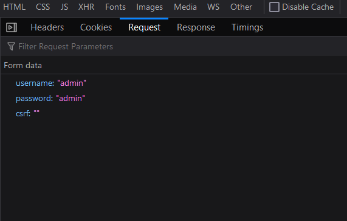
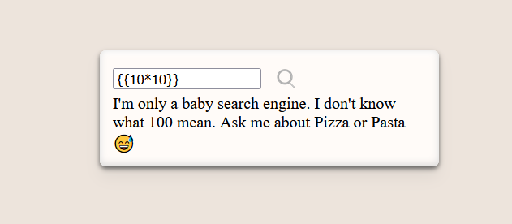

- [PART 1](#part-1)
- [PART 2](#part-2)

### PART 1

We have a web page at *localhost:8085/* that has a login form. Also we have the server code. By looking at the code we can extract 4 urls:
- *localhost:8085/*
- *localhost:8085/login*
- *localhost:8085/logout*
- *localhost:8085/parcham*

*parcham* is our target so we can try this url:


We can't access this page without logging in, and we need to log in as *parcham*.

So we have to somehow bypass login and authentication phase. We can try common user/pass combinations like admin/admin. Unfortunately, no common user/pass works but we can examine the the request and response:



We can see that we have *username* and *password* fields plus an empty *csrf* field so we don't neeed to worry about that. Also, the response doesn't give us any information  whether the username or password is valid, it validates the combination.

So we can try common vulnerabilites and the most popular one in these circumstances is SQLI. By looking at the code we can find the following snippet that actually performs the login query:
```javascript
const sql = 'Select * from users where username = ? and password = ? order by id';
    connection.query(sql, [usrname, passwd], function(err, QueryResponse)
```
`?` is used to escape special characters in the strings so basic SQLI techniques is not going to work. [This link](https://github.com/mysqljs/mysql#escaping-query-values) exlains how the escaping works for `?`. According to this document:
> Objects are turned into key = 'val' pairs for each enumerable property on the object. If the property's value is a function, it is skipped; if the property's value is an object, toString() is called on it and the returned value is used. 

Also we can see this line in the code:
```javascript
app.use(bodyParser.urlencoded({extended: true}))
```
This means the middleware can parse any type of objects given as parameters. According to [this document](https://github.com/expressjs/body-parser#bodyparserurlencodedoptions):
> The `extended` option allows to choose between parsing the URL-encoded data with the querystring library (when false) or the qs library (when true). The "extended" syntax allows for rich objects and arrays to be encoded into the URL-encoded format, allowing for a JSON-like experience with URL-encoded. For more information, please see the qs library.

So we can definitely pass objects to HTTP request and the query statement. For example, given `username=parcham&password[a]=b` parameters, query statement would be:
```sql
Select * from users where username = parcham and password = `a` = 'b' order by id;
```
password is first compared with `a`'s value, then the result is compared with `'b'` string. So we can replace `a` with `password` that way the first part of the statement is always going to be *true*. The challenge is for the `'b'` string, fortunately MySQL converts strings to integers when comparing integers to strings:
```python 
"1aaaaa" -> 1
"2aaaaa" -> 2
...
```
So we can use `'1aaaa'` instead of `'b'`:
`username=parcham&password[password]=1aaaa`
Query will look like this:
```sql
Select * from users where username = parcham and password = `password` = '1aaaa'
```
We can use our browser to modify the POST request and change the parametrs:


By clicking send, we get 302 code and by following the link we can see the flag:


### PART 2
We have a web page at *localhost:8080/* that has a search form but the server's code is not available.


Testing a random text we get the following result back:


Our input is shown in the output. This can lead to various attacks, including XSS, SSTI, etc. Looking at the page source code we can find the following tag at the top:
```html
<script>
         function search(){
             let search_something = $('#search_something')[0].value;
             if(search_something.length > 0){
                 $.post("/search", {'search_something': search_something}, function(data){
                     $('#result')[0].innerHTML = '<div>' + data + '</div>';
                 });
             }
         }
</script>
```
So anything we write in `search_something` is sent to `/search` and the result is shown inside a *div*. There is not any more useful information for us. So we try aforementioned attacks. We can try `<scirpt>` as input:


Injection was successful! But XSS is not helpful for this challenge since flag is stored on the server and XSS targets clients. So we probably need to find a way for RCE. To limit the scope we can use nmap and try getting more info about the running server:
`nmap -sV 127.0.0.1 -p 8080`


So the server is using a Python, Werkzeug-based web framework: The only candidate is **Flask**. Flask uses jinja2 which may be vulnerable to SSTI.
To check our theory we can use *{{10\*10}}* as the payload. If the result is 100 we'll know for sure that it is vulnerable to SSTI:



So we have a vulnerability: **SSTI**. Exploiting SSTI, we can execute any python code:


So we can use `` to find code files and later inspect these files:


We have a problem and the server seems to filter our input based on a blacklist. To find all of the filtered characters we can use the following script:
```Python
import requests, string

chars = string.printable
url = "http://127.0.0.1:8080/search"
my_str = ""

for char in chars:
	my_data = {'search_something': char}
	x = requests.post(url, data=my_data)
	if "oh Nooo!" in x.text:
		print(char, "is filtered")
```
The result is:
```
' is filtered
. is filtered
/ is filtered
[ is filtered
] is filtered
_ is filtered
```
Also, there may be some keywords in the blacklist.
So `` doesn't work because of the `.`. We can easily bypass this filter:`` but we get an exception:


but `print()` works:


So the code probably has already imported `os` we need to find another way to get to the flag (either by using python code execution or accessing code variables like wit `{{request}}`) 

I couldn't find the correct payload to use. 